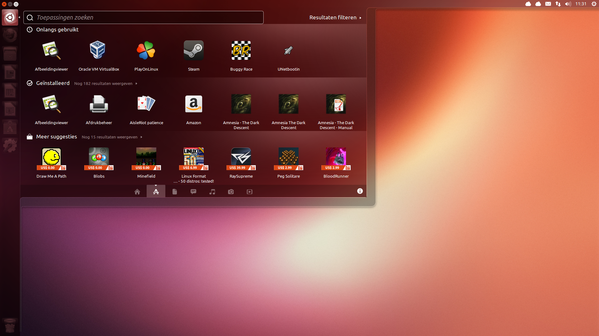
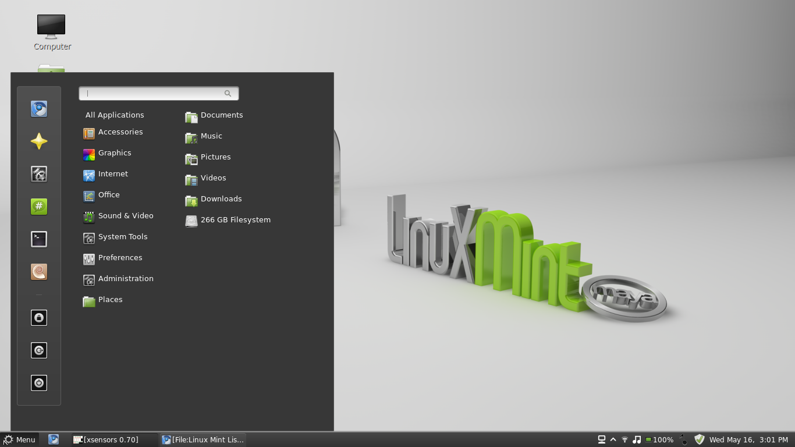
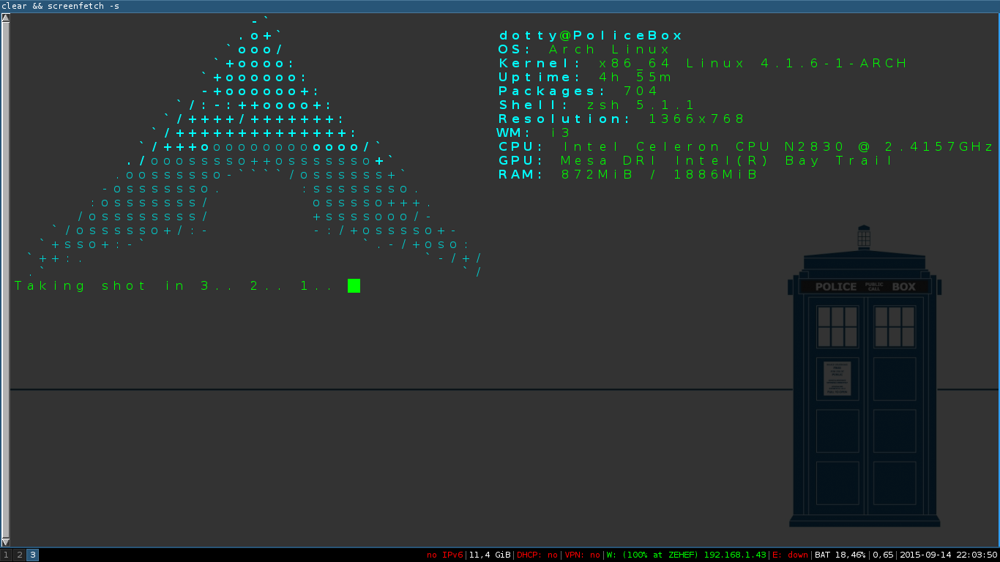

\maketitle

# Introduction

## Lexique :
- OS : Operating System (Système d'exploitation)
- Kernel : Cœur d'un OS qui gère le hardware
- Userland : Partie de l'OS qui interagit avec l'utilisateur
- GUI : interface graphique
- CLI : ligne de commande 
- Distribution : "Version" de Linux

## Mais dis moi Jamy, c'est quoi...
- Linux ?
- Un kernel, créé par Linus Torvalds
- Un OS : GNU/Linux

## A new challenger is approaching!
- Linux est indispensable en Spé
- Philosophie Unix, assez différente de Windows
- Orienté utilisateurs avancés

# Le terminal

## Le terminal
- Composé de deux éléments :
	- Émulateur de terminal
	- Shell

## Un terminal

## Un autre terminal

## D'où ça sort ?
- Datent des terminaux physiques des années 80
- Ce qu'on appelle couramment un terminal

## Shell heure d'interpréter
> - Exemples : csh, ksh, bash, zsh...
 - Interprète les commandes
 - De vrais langages de programmation

## CLIquer, c'est mal
> - Peut tout faire
> - Est légère (plus que le GUI)
> - Est rapide (plus que le GUI)

# le shell

## les bases
> - `commande -options paramètres`
> - `pwd`, `ls` et `tree`
> - `cd`
> - `ln`, `ln -s`

## flux 
> - redirections: `>`,`<`,`>>`,`2>`...
> - combinaisons (pipes): `|`
> - allez au tp !

## la recherche
> - `find /usr  -name gcc`
> - la methode sale (mais efficace): ls / -R | grep tontruc

## jouer avec les fichiers
> - `cat`, `less`
> - `touch`, `mkdir`
> - `cp`, `mv`
> - `rm`, `rmdir`

## Faisons du droit
- lecture (read, r)
- écriture (write, w)
- exécution (execute, x)
- `chown`, `chmod`

## `Root secours`
- super-utilisateur
- DANGER
- `su`, `sudo`
- réfléchissez

# La documentation

## Man
- 2 options intéressantes:
- `man -f ls` (= `whatis`): courte description
- `man -k ls` (= `apropos`): pages liées

## Man chapters
> - préciser un chapitre:
> - `man 1 printf`
> - `man 3 printf`
> - `man 3o printf`
> - afficher tous les chapitres:
> - `man -a printf`

## Gnu info
- alternative gnu à `man`
- `info ls`
- mais `man` reste beaucoup plus utilisé

## Help
- courte aide inclue dans le programme
- `ls --help`

## Google
- si vous n'avez pas l'information ... google it!
- ubuntu-fr.org
- wiki.archlinux.fr
- stackoverflow.com

# Les paquets

## Qu'est-ce qu'un package?
> - Ensemble de programmes ou de bibliothèques
> - Installable
> - Moyen de simplifier l'installation des programmes

## Qu'est-ce qu'un gestionnaire de paquets?
> - Gère tous les paquets du système
> - Plusieurs fonctions :
	- Maintient le système a jour
	- Installe et supprime les paquets
> - Gère les dépendances
> - Parfois fournit des conseils (dépendances optionnelles)

## apt est votre meilleur ami
> - Installer un paquet : `apt-get install <pkg>`
> - Supprimer un paquet : `apt-get remove <pkg>`
> - Mettre a jour la DB : `apt-get update`
> - Mettre a jour le système : `apt-get upgrade`
> - Rechercher un paquet : `apt-cache search <exp>`
> - `man apt-get`, `man apt-cache`

# Environnements       
                                                         
## Variables d'environnement                                                    
> - $PATH
> - $HOME
> - $PWD
> - $LANG
> - $TERM
> - $EDITOR

## Racines                                                                      
> - /boot                                                                       
> - /dev                                                                        
> - /home                                                                       
> - /etc                                                                        
> - /mnt                                                                        
> - /bin                                                                        
> - /sbin                                                                       
> - /lib                                                                        
> - /usr                                                                        
> - /tmp                                                                        

## Compilons
> - ./configure
> - make
> - make install

# Les GUI
                                                                                 
## On va se deGUIser                                                          
> - Choix utilisateur avant tout
> - Différentes distributions ~= Différentes GUI
> - Windows vs Tails
> - KDE (saruta -- "KDE c'est bien pour ceux qui aiment KDE")

## On va se deGUIser

> - Windows manager
    - Openbox
    - Muffin
> - Tails manager
    - i3
    - XMonad
    - awesome

## T'ail beau

# Distributions

## Debian since 1993
> - `Debra` et `Ian`
> - SPI = Software in the Public Interest
> - GNOME
> - STAAAABLEEE !!!

## Debian since 1993
 - `Debra` et `Ian`
 - SPI = Software in the Public Interest
 - GNOME
 - Ou pas.

## Debian
> - 4 Branches
> - Stable
    - stable/main/
    - stable/non-free/
    - stable/contrib/
  - Testing ..
  - Unstable ..

## Ubuntu
> - Un nom, une philosophie
	- "Humanity toward others"
	- "the belief in a universal bond of sharing that connects all humanity"
> - Basée sur Debian
	- APT
	- Stabilité
	- 6 months releases - Long Term Support
> - Son propre environnement de Bureau
	- Unity : basé sur Gnome
> - Beaucoup de pacquets pré-installés

## Ubuntu
> - Maintenu par Cannonical
	- Une companie sud-africaine
> - Avantages
	- Facile d'utilisation
	- Intuitif
	- Parfais pour les débutants / utilisateurs lamdas
	- Stabilité
> - Defauts
	- Lourd
	- Met en retrait la CLI et le terminal
	- Versions parfois en retard

## Ubuntu

## Derivées (ubuntu)
> - (K/X/L)Ubuntu
	- KDE, XFCE, LXDE
> - Ubuntu studio
> - Linux Mint
	- Unity ? *Rage Quit* !
	- Cinnamon, Mate

## Un thé à la menthe svp !

## Fedora
> - Forme beta de Red Hat Enterprise Linux (RHEL)
> - vitrine d'innovations
> - 3 "sous-distributions": Server, Workstation et Cloud

## Fedora
> - Dandified Yum/Yum (DNF)
> - RPM Packed Manager (RPM) 
> - Linus Torvalds a beaucoup utilisé cette distribution.

## Fedora

## ArchLinux:   Keep It Simple, Stupid.
> - KISS : une philiosophie minimaliste
> - DIY : une philosophie de débrouillard
> - Rolling-release : une philosophie qui roule
> - "[Arch Linux] is what you make it."

## ArchLinux:   Keep It Simple, Stupid.
 - KISS : une philiosophie minimaliste
 - DIY : une philosophie de débrouillard
 - Rolling-release : une philosophie qui roule
 - "[Arch Linux] is what you make it." : et là, c'est le drame.

## ArchLinux: Keep It Simple, Stupid

## ArchLinux:   Keep It Simple, Stupid.
> - `pacman`
> - `yaourt`
> - `systemctl`

## ArchLinux:   Keep It Simple, Stupid.

## Sources
> - man
> - man man
> - man man man ...
> - google

## The end
> - Questions ?

## The end
> - Questions ? Remarques ?

## The end
> - Questions ? Remarques ? Soucis choses pas claires ?

## The end
- Questions ? Remarques ? Soucis choses pas claires ?
- TP en salles machines !
- Merci à tous !

